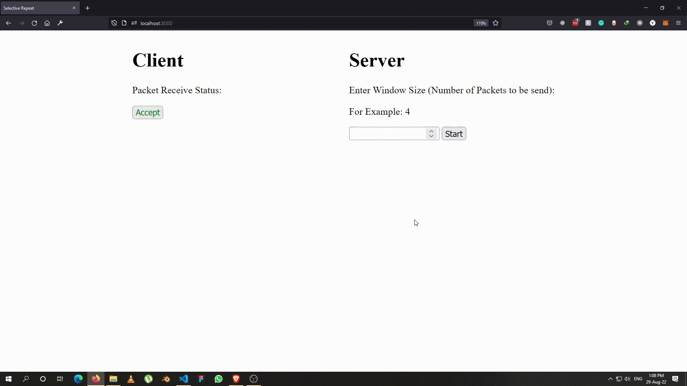

# Selective Repeat ARQ
## Implemented using JS, Node, Express and Socket.io

Packet Delay (Timer) on the server is set to 3 seconds.

### How it Works?
If an acknowledge is not received of a certain packet by the server then the server sends the remaining packet along with the last packet of the window.

### How to Run?

1. Clone the Repository by running git clone https://github.com/YarooqH/DCN---Selective-Repeative-ARQ
2. run npm install
3. Change index.html directory in server.js at line 59 according to your path of index.html
4. npm run dev
5. Opens at localhost:3000

